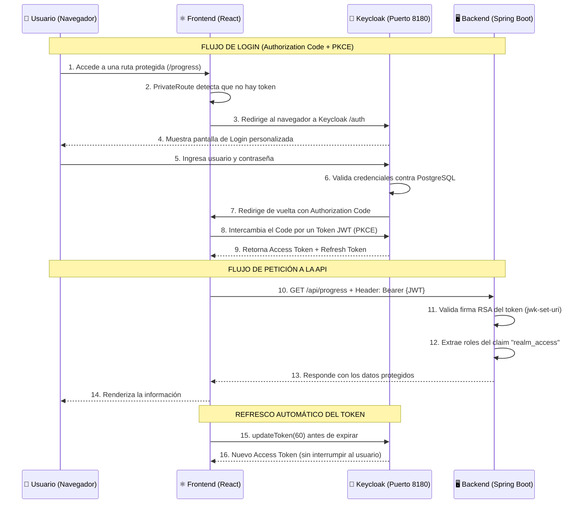

# 🔐 Sistema de Autenticación OAuth 2.0 con Keycloak

> **Protocolo:** OAuth 2.0 + OpenID Connect (OIDC)  
> **Flujo:** Authorization Code con PKCE (`S256`)  
> **Servidor de Identidad:** Keycloak 26.0 (contenerizado en Docker)  
> **Idioma de la interfaz:** Español (configurado por defecto)

---

## 📑 Tabla de Contenido

1. [¿Por qué Keycloak y OAuth 2.0?](#-1-por-qué-keycloak-y-oauth-20)
2. [Arquitectura del Flujo de Autenticación](#-2-arquitectura-del-flujo-de-autenticación)
3. [Implementación Paso a Paso](#-3-implementación-paso-a-paso)
   - [Paso 1: Infraestructura Docker](#paso-1-infraestructura-docker-docker-composeyml)
   - [Paso 2: Configuración del Realm](#paso-2-configuración-del-realm-realm-exportjson)
   - [Paso 3: Backend como Resource Server](#paso-3-backend-como-resource-server-spring-boot)
   - [Paso 4: Frontend con keycloak-js](#paso-4-frontend-con-keycloak-js-react)
   - [Paso 5: Tema Visual Personalizado](#paso-5-tema-visual-personalizado-keycloak-theme)
4. [Comandos Esenciales](#-4-comandos-esenciales)
5. [Usuarios de Prueba](#-5-usuarios-de-prueba)
6. [Preguntas Frecuentes](#-6-preguntas-frecuentes)

---

## 🏛️ 1. ¿Por qué Keycloak y OAuth 2.0?

En una arquitectura de microservicios, **ningún servicio debe almacenar contraseñas**. Delegamos toda la gestión de identidad a un servidor centralizado (Keycloak), que actúa como el único punto de autenticación. Esto nos da:

| Beneficio | Descripción |
|-----------|-------------|
| **Seguridad** | Las contraseñas nunca viajan al backend ni al frontend. Solo se intercambian tokens JWT firmados criptográficamente (RSA). |
| **Estándar de la industria** | OAuth 2.0 + OIDC es el mismo protocolo que usan Google, GitHub, Microsoft, etc. |
| **Registro y Login listo** | Keycloak provee pantallas de login, registro, recuperación de contraseña y gestión de sesiones sin código adicional. |
| **Escalabilidad** | Cualquier nuevo microservicio solo necesita validar tokens JWT, sin conocer contraseñas. |
| **Roles centralizados** | Los roles (STUDENT, PROFESSOR, ADMIN) se definen una sola vez en Keycloak y viajan dentro del token. |

---

## 🔄 2. Arquitectura del Flujo de Autenticación

### Diagrama de Secuencia Completo



### ¿Qué es cada componente?

| Componente | Rol en OAuth 2.0 | Puerto |
|------------|-------------------|--------|
| **Keycloak** | Authorization Server (emite y valida tokens) | `8180` |
| **Spring Boot** | Resource Server (protege la API, valida JWT) | `8080` |
| **React** | Client (SPA pública, usa `keycloak-js`) | `5173` |
| **PostgreSQL** | Almacena usuarios, sesiones y configuración de Keycloak | `5432` |

---

## 🛠️ 3. Implementación Paso a Paso

> **Orden recomendado de presentación:** Infraestructura → Realm → Backend → Frontend → Tema Visual.

---

### Paso 1: Infraestructura Docker (`docker-compose.yml`)

**Archivo:** `docker-compose.yml` (sección `keycloak`, líneas 37-63)

Se agregó Keycloak como un contenedor Docker que se conecta a la misma instancia de PostgreSQL que ya usábamos. Esto es lo que hace cada configuración:

```yaml
keycloak:
  image: quay.io/keycloak/keycloak:26.0
  container_name: keycloak
  restart: always
  command: start-dev --import-realm              # ① Modo desarrollo + importar realm automáticamente
  environment:
    KC_DB: postgres                               # ② Usa PostgreSQL como base de datos (no H2)
    KC_DB_URL: jdbc:postgresql://postgres:5432/keycloak
    KC_DB_USERNAME: postgres
    KC_DB_PASSWORD: change_this_postgres_password
    KEYCLOAK_ADMIN: admin                         # ③ Credenciales del panel de administración
    KEYCLOAK_ADMIN_PASSWORD: admin
    KC_HEALTH_ENABLED: "true"                     # ④ Habilita endpoint de salud (/health/ready)
    KC_SPI_THEME_LOGIN_THEME: academic            # ⑤ Fuerza nuestro tema personalizado
  ports:
    - "8180:8080"                                 # ⑥ Expone Keycloak en el puerto 8180 del host
  volumes:
    - ./keycloak/realm-export.json:/opt/keycloak/data/import/realm-export.json:ro  # ⑦ Auto-importa el realm
    - ./keycloak/theme/academic:/opt/keycloak/themes/academic:ro                   # ⑧ Monta el tema custom
  depends_on:
    postgres:
      condition: service_healthy                  # ⑨ Espera a que PostgreSQL esté listo
  healthcheck:                                    # ⑩ El backend espera a que Keycloak responda 200
    test: ["CMD-SHELL", "exec 3<>/dev/tcp/127.0.0.1/9000; ..."]
    interval: 10s
    retries: 15
```

**Decisiones importantes:**
- `--import-realm` importa la configuración del realm **solo si no existe**. Si el realm ya está creado (la BD persiste), no lo sobrescribe.
- El **healthcheck** es crítico: el contenedor `academic-service` tiene `depends_on: keycloak: condition: service_healthy`, lo que garantiza que Spring Boot no arranque hasta que Keycloak esté completamente listo.
- Se usa el puerto `8180` (no el `8080` por defecto) para no chocar con Spring Boot.

---

### Paso 2: Configuración del Realm (`realm-export.json`)

**Archivo:** `keycloak/realm-export.json`

Este archivo JSON define **todo** lo que Keycloak necesita saber sobre nuestra aplicación. Se importa automáticamente al iniciar el contenedor.

```json
{
  "realm": "academic-platform",
  "loginTheme": "academic",
  "internationalizationEnabled": true,
  "defaultLocale": "es",
  "registrationAllowed": true,
  "roles": {
    "realm": [
      { "name": "STUDENT" },
      { "name": "PROFESSOR" },
      { "name": "ADMIN" }
    ]
  },
  "defaultRoles": ["STUDENT"],
  "clients": [{
    "clientId": "academic-frontend",
    "publicClient": true,
    "standardFlowEnabled": true,
    "redirectUris": ["http://localhost:5173/*"],
    "webOrigins": ["http://localhost:5173", "+"]
  }],
  "users": [
    { "username": "admin",   "email": "admin@academic.local",   "realmRoles": ["ADMIN"] },
    { "username": "student", "email": "student@academic.local", "realmRoles": ["STUDENT"] }
  ]
}
```

**Conceptos clave del realm:**

| Campo | Qué hace |
|-------|----------|
| `realm` | Nombre del "dominio" de identidad. Todos los tokens incluyen `iss: .../realms/academic-platform`. |
| `publicClient: true` | Indica que el frontend es una SPA (no tiene un secreto de servidor). Usa PKCE en su lugar. |
| `standardFlowEnabled` | Habilita el flujo Authorization Code (el más seguro para SPAs). |
| `redirectUris` | URLs a las que Keycloak puede redirigir después del login. Solo acepta `localhost:5173`. |
| `webOrigins: ["+"]` | Permite CORS automáticamente desde los `redirectUris`. |
| `defaultRoles: ["STUDENT"]` | Todo usuario nuevo recibe automáticamente el rol STUDENT al registrarse. |
| `defaultLocale: "es"` | Toda la interfaz de Keycloak se muestra en español. |

---

### Paso 3: Backend como Resource Server (Spring Boot)

El backend **nunca** maneja credenciales. Solo valida que los tokens JWT que recibe sean legítimos.

#### 3.1 Dependencia Maven (`pom.xml`)

```xml
<dependency>
    <groupId>org.springframework.boot</groupId>
    <artifactId>spring-boot-starter-oauth2-resource-server</artifactId>
</dependency>
```

> Esta dependencia convierte nuestra API en un **Resource Server** OAuth 2.0. Spring Boot descarga automáticamente las llaves públicas RSA de Keycloak para verificar las firmas de los tokens.

#### 3.2 Configuración (`application.yml`)

```yaml
spring:
  security:
    oauth2:
      resourceserver:
        jwt:
          issuer-uri: ${KEYCLOAK_ISSUER_URI:http://localhost:8180/realms/academic-platform}
```

> `issuer-uri` le dice a Spring Boot dónde encontrar a Keycloak. Al arrancar, Spring descarga automáticamente los certificados RSA desde el endpoint `.well-known/openid-configuration` y los cachea en memoria.

#### 3.3 Filtros de Seguridad (`SecurityConfig.java`)

```java
@Configuration
@EnableWebSecurity
public class SecurityConfig {

    @Bean
    public SecurityFilterChain filterChain(HttpSecurity http) throws Exception {
        http
            .cors(cors -> cors.configurationSource(corsConfigurationSource()))
            .csrf(csrf -> csrf.disable())                          // ① CSRF deshabilitado (usamos tokens)
            .authorizeHttpRequests(authz -> authz
                .requestMatchers("/api/health").permitAll()        // ② Health check público
                .anyRequest().authenticated()                      // ③ Todo lo demás requiere token
            )
            .oauth2ResourceServer(oauth2 -> oauth2
                .jwt(jwt -> jwt.jwtAuthenticationConverter(        // ④ Convierte claims en roles
                    jwtAuthenticationConverter()
                ))
            );
        return http.build();
    }

    // Extrae los roles del claim "realm_access" del JWT de Keycloak
    private Collection<GrantedAuthority> extractRoles(Jwt jwt) {
        Map<String, Object> realmAccess = jwt.getClaim("realm_access");
        Collection<String> roles = (Collection<String>) realmAccess.get("roles");
        return roles.stream()
            .map(role -> new SimpleGrantedAuthority("ROLE_" + role.toUpperCase()))
            .collect(Collectors.toList());
    }

    // Configuración CORS: solo permite peticiones desde el frontend
    @Bean
    CorsConfigurationSource corsConfigurationSource() {
        CorsConfiguration config = new CorsConfiguration();
        config.setAllowedOrigins(List.of("http://localhost:5173"));
        config.setAllowedMethods(List.of("GET", "POST", "PUT", "DELETE", "OPTIONS"));
        config.setAllowedHeaders(List.of("Authorization", "Content-Type"));
        config.setAllowCredentials(true);
        // ...
    }
}
```

**¿Cómo funciona la validación del token?**
1. El frontend envía: `Authorization: Bearer eyJhbGciOi...`
2. Spring Boot extrae el JWT y **verifica la firma RSA** con las llaves públicas que descargó de Keycloak.
3. Si la firma es válida y el token no ha expirado, extrae los roles del claim `realm_access.roles`.
4. Los roles se convierten a `ROLE_STUDENT`, `ROLE_ADMIN`, etc. para usar con `@PreAuthorize` si es necesario.
5. Si el token es inválido o está ausente, responde con **HTTP 401 Unauthorized**.

---

### Paso 4: Frontend con `keycloak-js` (React)

El frontend es un **Cliente Público** (SPA) que usa la librería oficial `keycloak-js` para manejar todo el flujo de autenticación.

#### 4.1 Inicialización del adaptador (`keycloak.ts`)

```typescript
import Keycloak from 'keycloak-js'

const keycloak = new Keycloak({
  url: 'http://localhost:8180',          // URL de Keycloak
  realm: 'academic-platform',            // Nombre del realm
  clientId: 'academic-frontend',         // ID del cliente público
})

export default keycloak
```

> Este archivo crea una **instancia única** de Keycloak que se comparte en toda la aplicación.

#### 4.2 Proveedor de Autenticación (`AuthProvider.tsx`)

```tsx
export function AuthProvider({ children }) {
  useEffect(() => {
    const init = async () => {
      const authenticated = await keycloak.init({
        onLoad: 'check-sso',           // ① No fuerza login en páginas públicas
        silentCheckSsoRedirectUri:      // ② Verifica sesión existente sin parpadeo
          window.location.origin + '/silent-check-sso.html',
        pkceMethod: 'S256',            // ③ Usa PKCE (Proof Key for Code Exchange)
      })
      
      // Auto-refresh del token cuando expira
      keycloak.onTokenExpired = () => {
        keycloak.updateToken(30).catch(() => keycloak.logout())
      }
    }
    init()
  }, [])

  // Expone: isAuthenticated, token, login(), logout(), userId, userName
  return <AuthContext.Provider value={...}>{children}</AuthContext.Provider>
}
```

**Modos de inicialización:**
| Modo | Comportamiento |
|------|----------------|
| `check-sso` | Verifica si ya hay sesión activa en Keycloak. Si sí, obtiene el token silenciosamente. Si no, **no** redirige al login (ideal para landing pages públicas). |
| `login-required` | Fuerza la redirección al login inmediatamente. Útil para apps 100% privadas. |

**¿Qué es PKCE?**  
PKCE (Proof Key for Code Exchange) es una extensión de seguridad que protege el flujo Authorization Code contra ataques de interceptación. El frontend genera un `code_verifier` aleatorio y envía su hash (`code_challenge`) a Keycloak. Al intercambiar el code por el token, debe presentar el `code_verifier` original.

#### 4.3 Interceptor HTTP (`apiClient.ts`)

```typescript
// Antes de CADA petición HTTP al backend:
apiClient.interceptors.request.use(async (config) => {
  if (keycloak.token) {
    // Si el token expira en menos de 60 segundos, pide uno nuevo
    await keycloak.updateToken(60)
    config.headers.Authorization = `Bearer ${keycloak.token}`
  }
  return config
})

// Si el backend responde 401 (token inválido), redirige al login
apiClient.interceptors.response.use(
  (response) => response,
  async (error) => {
    if (error.response?.status === 401) {
      keycloak.login()
    }
    return Promise.reject(error)
  }
)
```

> **Este interceptor es la pieza clave** que hace que la autenticación sea transparente para el usuario. El token se refresca automáticamente antes de que expire, sin interrumpir la navegación.

#### 4.4 Rutas Protegidas (`PrivateRoute.tsx`)

```tsx
function PrivateRoute({ children }) {
  const { isAuthenticated, login } = useAuth()
  
  if (!isAuthenticated) {
    login()       // Redirige a Keycloak automáticamente
    return null
  }
  
  return children  // Si está autenticado, renderiza la página
}
```

> Las rutas como `/progress`, `/recommendations` y `/resources` están envueltas en `<PrivateRoute>`. Si el usuario no ha iniciado sesión, se le redirige a Keycloak antes de mostrar el contenido.

---

### Paso 5: Tema Visual Personalizado (Keycloak Theme)

Para que la pantalla de login/registro de Keycloak tenga la misma estética que nuestra aplicación React, se creó un **tema personalizado** llamado `academic`.

#### Estructura de archivos del tema

```
keycloak/theme/academic/login/
├── theme.properties         → Configuración del tema
├── resources/
│   ├── css/
│   │   └── custom-styles.css → Estilos visuales (Tailwind UI style)
│   ├── js/
│   │   └── script.js         → Lógica DOM (placeholders, reorden, idioma)
│   └── img/
│       └── login-bg.png      → Fondo isométrico generado
```

#### 5.1 Configuración del tema (`theme.properties`)

```properties
parent=keycloak.v2          # Hereda del tema base v2 de Keycloak
import=common/keycloak      # Importa recursos comunes
styles=css/custom-styles.css # Inyecta nuestro CSS personalizado
scripts=js/script.js         # Inyecta nuestro JavaScript personalizado
```

#### 5.2 Estilos CSS (`custom-styles.css`)

El CSS aplica un diseño inspirado en **Tailwind UI** sobre las clases internas de Keycloak (PatternFly v5):

- **Fondo:** Imagen isométrica 3D con animación sutil de "respiración" (`background-size` animado).
- **Tarjeta central:** Fondo blanco, `border-radius: 0.75rem`, sombra `shadow-lg`, máximo `400px` de ancho.
- **Inputs:** Altura compacta (`36px`), bordes `gray-300`, focus ring azul `blue-500`.
- **Botones:** Azul `blue-600` con hover `blue-700`, estilo plano profesional.
- **Elementos ocultos:** Selector de idioma (`#kc-locale`), textos de ayuda (`.pf-v5-c-form__helper-text`), branding de Keycloak (`.pf-v5-c-brand`).

#### 5.3 Script JavaScript (`script.js`)

El JavaScript manipula el DOM de Keycloak en el evento `DOMContentLoaded` para:

1. **Convertir labels a placeholders:** Las etiquetas de Keycloak ("Nombre", "Contraseña") se mueven al `placeholder` del input y se ocultan visualmente.
2. **Forzar texto en español:** Los placeholders se sobreescriben programáticamente a "Nombres", "Apellidos", "Correo electrónico", "Contraseña", "Confirmar contraseña".
3. **Ocultar el campo Usuario:** En el formulario de registro, el campo "Usuario" se oculta y se sincroniza automáticamente con el valor del campo "Correo electrónico" (el registro se hace solo por correo).
4. **Reordenar campos:** El formulario de registro se reordena vía DOM a: Nombres → Apellidos → Email → Contraseña → Confirmar contraseña → Botón.
5. **Personalizar enlaces:** El texto "¿No tienes cuenta?" y "Regístrate ahora" se reformatean en dos líneas.
6. **Título dinámico:** Dependiendo de si es la pantalla de login o registro, se inyecta `<h2>Iniciar sesión</h2>` o `<h2>Registro</h2>`.

---

## ⚡ 4. Comandos Esenciales

### Levantar todo el sistema (incluido Keycloak)

```bash
docker compose up --build -d
```

> Este único comando construye y levanta **todos** los contenedores: PostgreSQL, RabbitMQ, Keycloak, Backend, Frontend y los servicios de recomendación. Keycloak importa automáticamente el realm y el tema.

### Ver el estado de los contenedores

```bash
docker compose ps
```

### Ver los logs de Keycloak (útil para depurar)

```bash
docker compose logs keycloak -f
```

### Reiniciar Keycloak con datos limpios

```bash
docker compose down -v          # Elimina volúmenes (borra BD de Keycloak)
docker compose up --build -d    # Reconstruye todo desde cero
```

> ⚠️ El flag `-v` elimina el volumen de PostgreSQL. Esto significa que se perderán los usuarios registrados y Keycloak reimportará el `realm-export.json` limpio.

### Acceder al panel de administración de Keycloak

```
URL:      http://localhost:8180/admin
Usuario:  admin
Password: admin
Realm:    academic-platform (seleccionar en la esquina superior izquierda)
```

### Acceder a la pantalla de login/registro

```
Login:    http://localhost:8180/realms/academic-platform/account
Frontend: http://localhost:5173 (navegar a una ruta protegida)
```

---

## 👤 5. Usuarios de Prueba

Estos usuarios se crean automáticamente al importar el realm:

| Usuario | Contraseña | Correo | Rol |
|---------|-----------|--------|-----|
| `admin` | `admin` | admin@academic.local | ADMIN |
| `student` | `student` | student@academic.local | STUDENT |

> Cualquier usuario nuevo que se registre desde la pantalla de registro recibirá automáticamente el rol **STUDENT**.

---

## ❓ 6. Preguntas Frecuentes

> **¿Cómo evitan el problema de CORS en el login?**  
> No usamos Axios para hacer login directo contra la API de Keycloak. Redirigimos el navegador completo al servidor de Keycloak (Flujo Authorization Code), y una vez autenticado, Keycloak redirige de vuelta a React. Es el flujo más seguro para aplicaciones SPA y evita completamente problemas de CORS.

> **¿Qué pasa si el token expira?**  
> El interceptor de Axios (`apiClient.ts`) vigila el ciclo de vida del JWT. Antes de cada petición HTTP, ejecuta `keycloak.updateToken(60)`. Si el token expira en menos de 60 segundos, obtiene uno nuevo silenciosamente usando el Refresh Token. El usuario nunca nota la renovación.

> **¿Por qué `check-sso` y no `login-required`?**  
> Porque nuestra app tiene páginas públicas (landing, catálogo). Con `check-sso`, los usuarios pueden navegar libremente sin autenticarse. Solo se les redirige al login cuando intentan acceder a una ruta protegida por `<PrivateRoute>`.

> **¿Qué es el `jwk-set-uri` / `issuer-uri`?**  
> Es la URL donde Spring Boot descarga las **llaves públicas RSA** de Keycloak. Con estas llaves, el backend puede verificar criptográficamente que un token JWT fue firmado por Keycloak y no ha sido alterado, todo sin necesidad de contactar a Keycloak en cada petición.

> **¿Se puede agregar login con Google?**  
> Sí. Keycloak soporta Identity Providers externos. Solo es necesario crear credenciales OAuth en Google Cloud Console y configurarlas en Keycloak > Identity Providers > Google. No se requiere ningún cambio en el código del frontend ni del backend.

---

## 📁 Resumen de Archivos Modificados

| Archivo | Capa | Propósito |
|---------|------|-----------|
| `docker-compose.yml` | Infraestructura | Agrega el contenedor de Keycloak, healthcheck y volúmenes |
| `keycloak/realm-export.json` | Infraestructura | Define el realm, roles, cliente público y usuarios iniciales |
| `keycloak/theme/academic/login/theme.properties` | Tema | Registra el CSS y JS personalizados |
| `keycloak/theme/academic/login/resources/css/custom-styles.css` | Tema | Estilos Tailwind UI sobre PatternFly de Keycloak |
| `keycloak/theme/academic/login/resources/js/script.js` | Tema | Lógica DOM: placeholders, reorden, idioma español |
| `keycloak/theme/academic/login/resources/img/login-bg.png` | Tema | Fondo isométrico 3D del formulario de login |
| `academic-service/pom.xml` | Backend | Dependencia `spring-boot-starter-oauth2-resource-server` |
| `academic-service/src/.../application.yml` | Backend | Configura `issuer-uri` apuntando a Keycloak |
| `academic-service/src/.../SecurityConfig.java` | Backend | Filtros de seguridad, extracción de roles JWT, CORS |
| `frontend/src/keycloak.ts` | Frontend | Instancia del adaptador `keycloak-js` |
| `frontend/src/context/AuthProvider.tsx` | Frontend | Contexto React: init con `check-sso`, auto-refresh de tokens |
| `frontend/src/api/apiClient.ts` | Frontend | Interceptor Axios: inyección automática y refresco del JWT |
| `frontend/src/components/Auth/PrivateRoute.tsx` | Frontend | HOC que protege rutas y redirige al login si no hay sesión |
